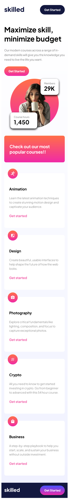

# 📚 eLearning Landing Page (Mobile First)

Una landing page moderna, enfocada en la educación digital y pensada exclusivamente para móviles (por ahora). Ideal para promocionar cursos online y atraer a nuevos estudiantes con un diseño colorido, claro y bien estructurado.

🔗 Demo GitHub Pages: https://emiliano-blackbird.github.io/elearning-landing-page-responsive/

## Características

    📱 Optimizada para dispositivos móviles
    🎨 Diseño atractivo y profesional
    📷 Uso de picture para imágenes responsive
    📊 Estadísticas visuales (número de cursos y miembros)
    📂 Componentes reutilizables y bien organizados
    🌈 Gradientes y colores personalizados con Sass
    🧩 Código modular usando @use en SCSS
    🚀 Preparado para escalar a desktop con media queries

## Tecnologías

    HTML5 Semántico

    SCSS (Sass Modular + Variables + Mixins)

    JavaScript (Módulo principal)

    Google Fonts: Plus Jakarta Sans

    Diseño Mobile First

    Vite (opcional si usás npm run dev)

## 📸 Capturas en móvil

## Cómo utilizar

Cloná el repositorio y abrilo localmente:

git clone https://github.com/Emiliano-Blackbird/elearning-landing-page-responsive.git
cd elearning-landing-page-responsive

Si estás usando Vite:

npm install
npm run dev

O simplemente abrí el index.html con Live Server en VS Code.

## 📱 Mobile First

    Actualmente este sitio está pensado solo para móviles.
    La estructura y los estilos se han construido con enfoque Mobile First, y se irán adaptando a tablet y desktop próximamente.

## Secciones

    Header: Logo + botón “Get Started”

    Hero: Título principal, descripción y llamada a la acción

    Stats: Números flotantes de cursos y miembros

    Popular Courses: 5 cursos destacados con íconos e info

    Footer: Logo + botón final

## 👨‍💻 Author

Emiliano Perez Paponi

Full Stack Developer

GitHub: @Emiliano-Blackbird

Mail: EmilianoPerezPaponi@gmail.com
